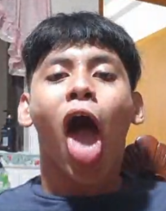

<a name="readme-top"/>

<br/>

<br />
<div align="center">
  <a href="https://github.com/CestinaLover/">
  <!-- TODO: If you want to add logo or banner you can add it here -->
    
  </a>
<!-- TODO: Change Title to the name of the title of your Project -->
  <h3 align="center">The Noirs!!</h3>
</div>
<!-- TODO: Make a short description -->
<div align="center">
  Welcome to my website fellow Noirs!.
</div>

<br />

<!-- TODO: Change the zyx-0314 into your github username  -->
<!-- TODO: Change the WD-Template-Project into the same name of your folder -->


---

<br />
<br />

<!-- TODO: If you want to add more layers for your readme -->
<details>
  <summary>Table of Contents</summary>
  <ol>
    <li>
      <a href="#overview">Overview</a>
      <ol>
      <li>
      <a href="#Description:">Website Instructions:</a>
      <ol>
      <li>
      <a href="#Features:">Features:</a>
    </li>
      <ol>
      <li>
      <a href="#Website-Instructions:">Website Instructions:</a>
    </li>
        <li>
          <a href="#File-Structure">Key Components</a>
        </li>
        <li>
          <a href="#technology">Technology</a>
        </li>
      </ol>
    </li>
    <li>
      <a href="#rules-and-principles">Rules and Principles</a>
    </li>
    <li>
      <a href="#resources">Resources</a>
    </li>
    <li>
      <a href="#my-projects">My Projects</a>
    </li>
  </ol>

</details>

---

## Overview

This project is a Hero Display Website that showcases distinct design layouts for different features using pure HTML and CSS. The website includes multiple pages for demonstration and emphasizes layout design.

## Description

This is my Seatwork 4 for my web design class. The goal is to Create a Features Display Website showcasing distinct design layouts for different features, utilizing various HTML and CSS techniques to highlight different design elements across multiple pages.

## Features

- **Multiple Pages**: The website consists of several pages, each demonstrating different layout designs.
- **Hero Section**: A prominent hero section on the homepage to capture users' attention.
- **Card Layouts**: Various card designs to showcase different features and content.
- **Pure HTML and CSS**: No JavaScript or external libraries, focusing on fundamental web design skills.
- **Responsive Design**: Ensures the website looks good on all devices.

## Website Instructions:

You will first be sent to the home page where you can read my About Me and other stuff,
once you are done reading, you can check out The Noir's and the Noir's Gallery by cicking the buttons on the top right, Navigate however you wish, and hope you enjoy my work!.

### File Structure

<!-- TODO: List of Key Components -->

```
WD-SEATWORK-4-JIGABOO-TX03
├─ assets
│  ├─ css
│  │  ├─ animate.css
│  │  ├─ flex-slider.css
│  │  ├─ fontawesome.css
│  │  ├─ owl.css
│  │  ├─ style.css
│  │  └─ templatemo-scholar.css
│  ├─ fonts
│  │  ├─ GODOFWAR.TTF
│  │  ├─ Halo.ttf
│  │  └─ SoloLevelDemo.otf
│  ├─ images
│  │  ├─ AdultWoo.jpg
│  │  ├─ Arkham.jpg
│  │  ├─ banner-bg.jpg
│  │  ├─ banner-item-01.jpg
│  │  ├─ banner-item-02.jpg
│  │  ├─ banner-item-03.jpg
│  │  ├─ Batman.png
│  │  ├─ Chief.png
│  │  ├─ contact-dec-01.png
│  │  ├─ contact-dec-02.png
│  │  ├─ course-01.jpg
│  │  ├─ course-02.jpg
│  │  ├─ course-03.jpg
│  │  ├─ course-04.jpg
│  │  ├─ course-05.jpg
│  │  ├─ course-06.jpg
│  │  ├─ DarkSky.jpg
│  │  ├─ Dousy.jpg
│  │  ├─ event-01.jpg
│  │  ├─ event-02.jpg
│  │  ├─ event-03.jpg
│  │  ├─ GoW.jpg
│  │  ├─ Halo.jpg
│  │  ├─ heatblast.png
│  │  ├─ HotJigaboo.jpg
│  │  ├─ jemoepeps.png
│  │  ├─ kratos.png
│  │  ├─ member-01.jpg
│  │  ├─ member-02.jpg
│  │  ├─ member-03.jpg
│  │  ├─ member-04.jpg
│  │  ├─ NightSky.jpg
│  │  ├─ NOIR.jpg
│  │  ├─ nyebe_white.png
│  │  ├─ service-01.png
│  │  ├─ service-02.png
│  │  ├─ service-03.png
│  │  ├─ snorlax jimbo.png
│  │  ├─ Stars.jpg
│  │  ├─ SUKUNA.png
│  │  ├─ SungJinWoo.png
│  │  ├─ TeenWoo.jpg
│  │  ├─ testimonial-author.jpg
│  │  ├─ TORII.jpg
│  │  ├─ Volcano.png
│  │  └─ youngWoo.jpg
│  ├─ img
│  │  ├─ AdultWoo.jpg
│  │  ├─ Arkham.jpg
│  │  ├─ Batman.png
│  │  ├─ Chief.png
│  │  ├─ DarkSky.jpg
│  │  ├─ Dousy.jpg
│  │  ├─ GoW.jpg
│  │  ├─ Halo.jpg
│  │  ├─ heatblast.png
│  │  ├─ HotJigaboo.jpg
│  │  ├─ jemoepeps.png
│  │  ├─ kratos.png
│  │  ├─ NightSky.jpg
│  │  ├─ NOIR.jpg
│  │  ├─ nyebe_white.png
│  │  ├─ snorlax jimbo.png
│  │  ├─ Stars.jpg
│  │  ├─ SUKUNA.png
│  │  ├─ SungJinWoo.png
│  │  ├─ TeenWoo.jpg
│  │  ├─ TORII.jpg
│  │  ├─ Volcano.png
│  │  └─ youngWoo.jpg
│  ├─ js
│  │  ├─ counter.js
│  │  ├─ custom.js
│  │  ├─ isotope.min.js
│  │  ├─ owl-carousel.js
│  │  └─ script.js
│  └─ webfonts
│     ├─ fa-brands-400.ttf
│     ├─ fa-brands-400.woff2
│     ├─ fa-regular-400.ttf
│     ├─ fa-regular-400.woff2
│     ├─ fa-solid-900.ttf
│     ├─ fa-solid-900.woff2
│     ├─ fa-v4compatibility.ttf
│     └─ fa-v4compatibility.woff2
├─ doc
│  └─ emmet.txt
├─ index.html
├─ readme.md
└─ vendor
   ├─ bootstrap
   │  ├─ css
   │  │  └─ bootstrap.min.css
   │  └─ js
   │     └─ bootstrap.min.js
   └─ jquery
      ├─ jquery.js
      ├─ jquery.min.js
      ├─ jquery.min.map
      ├─ jquery.slim.js
      ├─ jquery.slim.min.js
      └─ jquery.slim.min.map

```

### Technology

<!-- TODO: List of Technology Used -->

ACER PREDATOR HELIOS NEO 16


## Resources

<!-- TODO: Add References -->

| Title   | Purpose                               | Link                                     |
| ------- | ------------------------------------- | ---------------------------------------- |
| UIVERSE | A site containing UI elements for css | https://uiverse.io/buttons?orderBy=views |
| CODEPEN | A site for code lovers                | https://codepen.io/trending              |
| NONE    | NONE                                  | NONE                                     |
| NONE    | NONE                                  | NONE                                     |

## My Projects

| Title             | Purpose                                   | Link                                                        |
| ----------------- | ----------------------------------------- | ----------------------------------------------------------- |
| My Resume Project | A Project to use html to create a resume. | https://cestinalover.github.io/WD-Seatwork-jigaboo-2-TX03/  |
| My Midterm Exam   | Midterm Grade                             | https://cestinalover.github.io/WD-Midterm-Exam-Damaso-TX03/ |
| SEATWORK 3        | Schoolwork                                | https://cestinalover.github.io/WD-SEATWORK-3-JIGABOO-TX03/  |
| Hands On 2        | Schoolwork                                | https://cestinalover.github.io/WD-HANDS-ON-2-JIGABOO-TX03/  |
| SEATWORK 4        | Schoolwork                                | https://cestinalover.github.io/WD-SEATWORK-4-JIGABOO-TX03/  |
